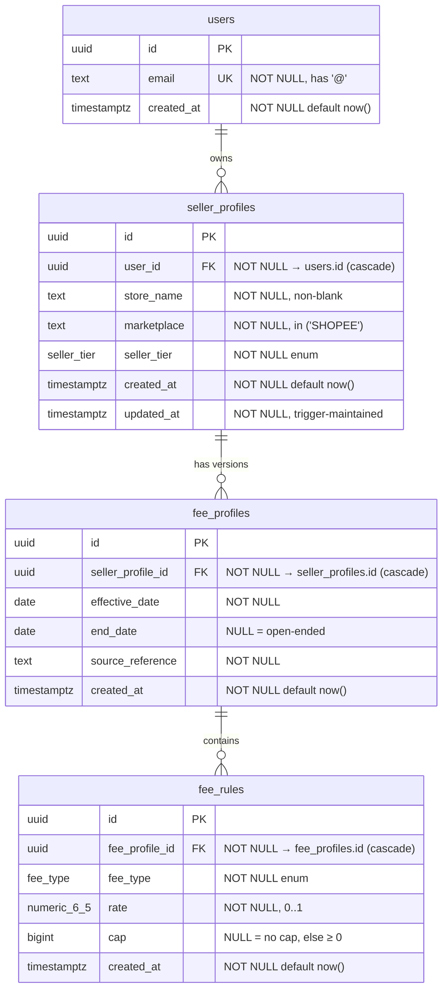

# Phase 2 — Step 1: Database Foundation

Persistence layer for the Shopee Seller Assistant. Supabase / PostgreSQL, SQL
migrations only (no Prisma). This document covers the schema diagram, the ER
explanation, the indexing rationale, and the release validation checklist.

The Phase 1 calculation core is **frozen and untouched**; this layer only stores
the data that the core consumes. Value domains mirror the frozen Phase 1 types
so a future thin repository can map rows → `FeeRateRow` with no transformation
logic.

---

## 1. Schema diagram

Cardinality: one `users` row → many `seller_profiles`; one `seller_profiles`
row → many `fee_profiles` (versioned by date window); one `fee_profiles` row →
many `fee_rules` (one per fee type, so up to three: ADMIN, SERVICE, PAYMENT).

---

## 2. ER explanation

**users.** Account root. `id` is a server-generated `uuid`; `email` is unique and
structurally checked. Deliberately minimal — authentication and profile metadata
are out of scope. Deleting a user cascades to everything they own.

**seller_profiles.** A *store*. A user may own several, so this is a child of
`users` via `user_id`. `seller_tier` lives here because tier is a property of the
store, and it is the value Phase 1 resolves fees by. `marketplace` is constrained
to `SHOPEE` (Phase 1 is Indonesia/Shopee); broadening is a future migration, not
a code change. `updated_at` is maintained by a trigger.

> MVP scope note: tier is modelled as the store's *current* state. Fee history is
> versioned by date window (below), not by tier-change events. If per-tier-change
> history is needed later, `seller_tier` would move to its own versioned table —
> outside this step's required tables.

**fee_profiles.** A *versioned fee configuration* for one store, valid over
`[effective_date, end_date]` (`end_date` null = still in force). `source_reference`
records provenance (matches Phase 1 `sourceRef`). The exclusion constraint
guarantees windows never overlap for a store, so the resolver finds **at most
one** profile as of any date — the DB-level expression of Phase 1 invariant G-4.

**fee_rules.** The actual fee numbers, one row per `fee_type`. Splitting rules
into child rows (rather than three columns on `fee_profiles`) keeps the table in
3NF, lets `fee_type` reuse the shared enum, and matches the Phase 1 shape where
each `FeeRateRow` carries `{ feeType, rate, cap }`. `rate` is a `numeric(6,5)`
fraction (exact, no float drift, mirroring `decimal.js`); `cap` is whole-rupiah
`bigint` or null.

**Why no `seller_tier` on `fee_profiles` / `fee_rules`.** Tier is owned by the
store; copying it down would duplicate data and risk divergence. Fee rows inherit
tier through their store — exactly Phase 1's "rows are tier-scoped by the caller"
contract.

---

## 3. Indexing rationale

Every index maps to a real access path; there are no speculative indexes.

| Index | Columns | Serves | Why not redundant |
|---|---|---|---|
| `users_pkey` | `users(id)` | row by id, all FK joins | primary key |
| `users_email_key` | `users(email)` unique | lookup/login by email; uniqueness | only path to email |
| `seller_profiles_pkey` | `seller_profiles(id)` | row by id, FK target | primary key |
| `seller_profiles_user_id_idx` | `seller_profiles(user_id)` | "all stores for a user" | FKs are **not** auto-indexed in PostgreSQL |
| `fee_profiles_pkey` | `fee_profiles(id)` | row by id, FK target | primary key |
| `fee_profiles_no_overlap` | gist `(seller_profile_id, daterange)` | enforces non-overlap; supports store + range probes | required by the exclusion constraint |
| `fee_profiles_lookup_idx` | `fee_profiles(seller_profile_id, effective_date desc)` | resolver: effective profile for store X as of date D | btree range scan the GiST index serves less efficiently for `effective_date <= D` ordering |
| `fee_rules_pkey` | `fee_rules(id)` | row by id | primary key |
| `fee_rules_one_per_type` | `fee_rules(fee_profile_id, fee_type)` unique | per-type uniqueness **and** "all rules for a profile" (leftmost prefix = FK lookup) | one composite covers both needs — no separate `fee_profile_id` index added |

Deliberately **omitted**: a standalone `fee_rules(fee_profile_id)` index (covered
by the unique composite's leftmost column) and a standalone
`fee_profiles(seller_profile_id)` index (covered by `fee_profiles_lookup_idx`'s
leftmost column).

---

## 4. Constraints summary (preventing impossible data)

- **Primary keys** on all four tables (`uuid`, server-generated).
- **Foreign keys** with `on delete cascade`: `seller_profiles.user_id`,
  `fee_profiles.seller_profile_id`, `fee_rules.fee_profile_id`.
- **NOT NULL** on every column that is logically required.
- **Unique**: `users.email`; `(fee_profile_id, fee_type)`.
- **Check**: email has `'@'`; `store_name` non-blank; `marketplace ∈ {SHOPEE}`;
  `end_date >= effective_date`; `rate ∈ [0,1]`; `cap is null or cap >= 0`.
- **Exclusion (GiST)**: no overlapping fee windows per store (G-4).
- **Enums**: `seller_tier`, `fee_type` reject any value outside the Phase 1 sets.

---

## 5. Release validation checklist

- **Every FK valid** — ✓ three FKs, each references the parent PK, all
  `on delete cascade`; no orphan paths.
- **Every index justified** — ✓ see §3; each ties to a PK, a uniqueness rule, an
  un-indexed FK, or the resolver query. Two potential indexes were intentionally
  omitted as redundant.
- **No redundant column** — ✓ tier is stored once (on the store); nothing is
  copied across tables; no computed/derivable column is stored.
- **No duplicated data** — ✓ fee numbers live only in `fee_rules`; provenance only
  in `fee_profiles`; identity only in `users`.
- **Third normal form** — ✓ in each table every non-key attribute depends on the
  whole key and nothing but the key. `fee_rules` candidate key
  `(fee_profile_id, fee_type)` determines `rate`/`cap` with no transitive
  dependency; `seller_profiles` attributes depend only on `id`.
- **Compatible with Phase 1 types** — ✓
  - `seller_tier` enum == `SellerTier` (REGULAR, STAR, STAR_PLUS, MALL)
  - `fee_type` enum == `FeeType` (ADMIN, SERVICE, PAYMENT)
  - `rate numeric(6,5) ∈ [0,1]` == `Rate` fraction
  - `cap bigint ≥ 0 | null` == `Money` cap (whole rupiah) `| null`
  - `effective_date` / `end_date date` (null = open) == `effectiveDate` /
    `endDate: IsoDate | null`
  - `source_reference text` == `sourceRef`
  - A store's profile-as-of-date + its three rules reconstruct exactly the
    `FeeRateRow[]` the resolver expects.

Boundaries respected: database only — no repositories, no API, no UI, no auth,
no business logic, no calculations. Phase 1 calc-core was not modified.
